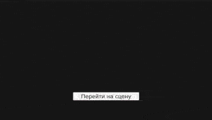

# Mirra Games Clock

WebGL-часы, которые берут время с сервера. Тестовое задание Mirra Games.

**Запуск:** https://dan0398.github.io/MirraGamesTestTask/

| Пример | Реализация |
|----------|------------|
|| |

## Архитектура

DI - Zenject. Логика - plain-классы в `ProjectContext` (переживает смену сцен), вьюхи - MonoBehaviour в TimeScene, зависимости получают через `[Inject]` из своего `SceneContext`. Один инсталлер - [`GameInstaller`](Assets/Scripts/App/Installers/GameInstaller.cs), все бинды в одном месте.

### Время

- [`AppClock`](Assets/Scripts/Time/AppClock.cs) - единственный источник времени в приложении: пара «базовое время + смещение по realtimeSinceStartup», поэтому ход монотонный и не зависит от подвисших кадров. Наружу - `Now` и события смены секунды/минуты.
- [`TimeSyncController`](Assets/Scripts/Time/Controller/TimeSyncController.cs) - один запрос при старте. Источники запрашиваются по [цепочке](Assets/Scripts/Time/Network/FallbackTimeProvider.cs): [Яндекс](Assets/Scripts/Time/Network/YandexTimeProvider.cs) (работоспособный запрос из тех. задания, но недоступен в GH Pages по CORS) → [timeapi.io](Assets/Scripts/Time/Network/TimeApiTimeProvider.cs) → [время устройства](Assets/Scripts/Time/Network/LocalMachineTimeProvider.cs), у каждого таймаут 5 секунд.
- Цвет визуала меняется в зависимости от значения минут: белый для чётного значения, зелёный для нечётного. Идея взята из примера.

### Редактирование

Режим правки работает с [черновиком](Assets/Scripts/Time/Controller/ClockEditController.cs): живые часы не трогаются, пока не нажато «Применить». «Отмена» просто закрывает режим, «Сброс» заново синхронизирует время с сервером.

- Драг стрелок ([`ArrowDragInput`](Assets/Scripts/Time/View/ArrowDragInput.cs)): угол курсора относительно центра циферблата, дельты копятся с выбором кратчайшей дуги и доводкой до целого часа/минуты ([`EditableClockView`](Assets/Scripts/Time/View/EditableClockView.cs)). Перенос через полночь и смену дня `DateTime.AddHours/AddMinutes` делает сам.
- Ввод через [Input Field](Assets/Scripts/Time/View/EditPanelView.cs): поля валидируются по применению ввода, дни ограничиваются по `DateTime.DaysInMonth` для текущего года и месяца.

## Стек

Unity 2022.3.62f3 · Zenject · Addressables · DOTween

## Структура

```
Assets/
  Scenes/                Bootstrap, TimeScene (Addressables-бандл)
  Scripts/
    App/                 загрузчик сцены, GameInstaller
    Time/                AppClock, Controller/, Network/, View/
    UI/                  анимации, перекраска, hover
  WebGLTemplates/
    FullscreenProgress/  шаблон WebGL-страницы
  Resources/             ProjectContext.prefab
```